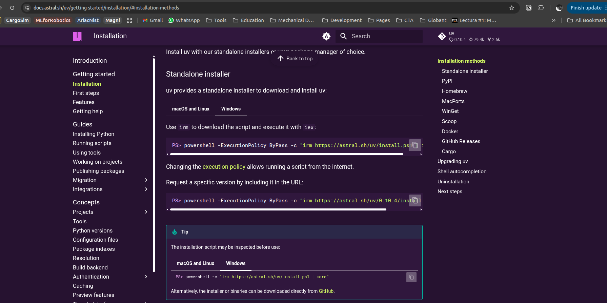

# Taller de IA para Desarrollo

Un taller integral de 8 sesiones explorar las técnicas de programación potenciadas por IA, desde los fundamentos de los LLM hasta flujos de trabajo agenticos.

## Resumen del taller

| Sesión | Tema | Tipo |
|--------|------|------|
| 1 | Fundamentos de LLM | Notebook |
| 2 | Ingeniería de prompts | Notebook |
| 3 | Desarrollo guiado por especificaciones (Kilo Code / Speckit) | Laboratorio |
| 4 | Servidores MCP (Stitch, Atlassian) | Laboratorio |
| 5 | Automatización de pruebas con Playwright | Laboratorio |
| 6 | Exploración de herramientas (Copilot, Antigravity) | Documentación |
| 7 | Flujos agenticos con Crew.ai | Laboratorio |
| 8 | Cierre y preguntas | Revisión |


## Inicio rápido

# Instala UV

https://docs.astral.sh/uv/getting-started/installation/#installation-methods



```bash
# Clonar el repositorio
git clone https://github.com/JAndresBP/genai-for-coding.git
cd genai-for-coding

# Crear entorno virtual
uv venv --python 3.11

#activate environment windows
# ./bin/activate.bat
# ./bin/activate.ps1
./bin/activate

```

## Descripción de las sesiones

### Sesión 1: Fundamentos de LLM
Introducción al panorama de la IA, el origen de los LLM y parámetros clave (temperature, top-k, top-p, longitud de salida, ventana de contexto).

**Laboratorio**: Conexión a la API de LLM y exploración de parámetros.

### Sesión 2: Ingeniería de prompts
Principios de ingeniería de prompts, riesgos de seguridad (prompt injection) y estrategias de protección (guardrails).

**Laboratorio**: Notebook con patrones de prompt y ejemplos de seguridad.

### Sesión 3: Desarrollo guiado por especificaciones
Introducción a Speckit, Kilo Code, Agents.md, Skills, Workflows y Modes.

**Laboratorio**: Crear una app React+Vite desde cero usando Speckit.

### Sesión 4: Servidores MCP
Integración de los servidores MCP (Stitch y Atlassian) para flujos de trabajo con Jira.

**Laboratorio**: Simulación en un escenario brownfield con integración a Jira.

### Sesión 5: Automatización de pruebas con Playwright
Uso de IA para automatizar pruebas con Playwright.

**Laboratorio**: Crear y ejecutar pruebas a partir de tickets de Jira.

### Sesión 6: Exploración de herramientas
Análisis profundo de GitHub Copilot y Antigravity.

**Laboratorio**: Análisis comparativo y experimentos.

### Sesión 7: Crew.ai
Construcción de flujos agentivos con el framework Crew.ai.

**Laboratorio**: Crear flujos de trabajo multi-agente.

### Sesión 8: Cierre
Sesión de preguntas y respuestas, revisión y cierre.

## Variables de entorno

Crea un archivo `.env` en la raíz del proyecto:

```bash
# Proveedores de LLM
OPENROUTER_API_KEY=your_openai_key
NVIDIA_BUILD_API_KEY=your_anthropic_key

# Jira (para las sesiones 4-5)
JIRA_URL=https://your-domain.atlassian.net
JIRA_EMAIL=your-email@example.com
JIRA_API_TOKEN=your_jira_token

# Otras herramientas
STITCH_API_KEY=your_stitch_key
```

## Resultados esperados

Al completar este taller, los participantes podrán:
- Entender los parámetros de los LLM y sus efectos
- Aplicar buenas prácticas de ingeniería de prompts
- Construir aplicaciones usando desarrollo guiado por especificaciones
- Integrar IA en flujos de trabajo de desarrollo mediante MCP
- Automatizar pruebas con IA y Playwright
- Comparar y evaluar herramientas de codificación asistida por IA
- Crear flujos de trabajo agentivos

## Licencia

Licencia MIT

