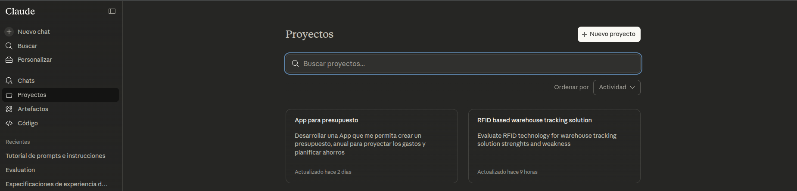
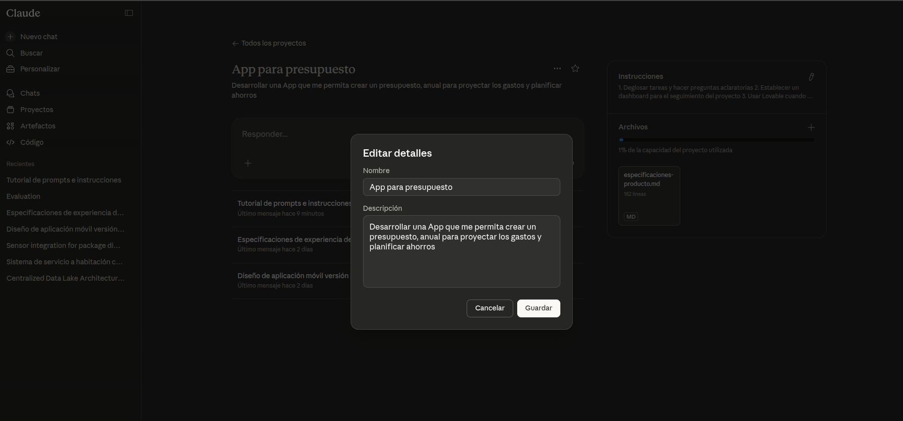
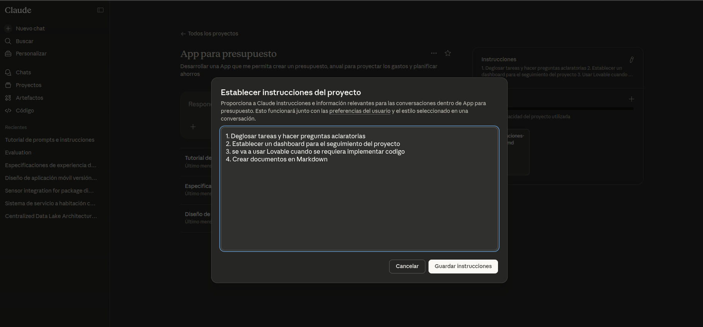
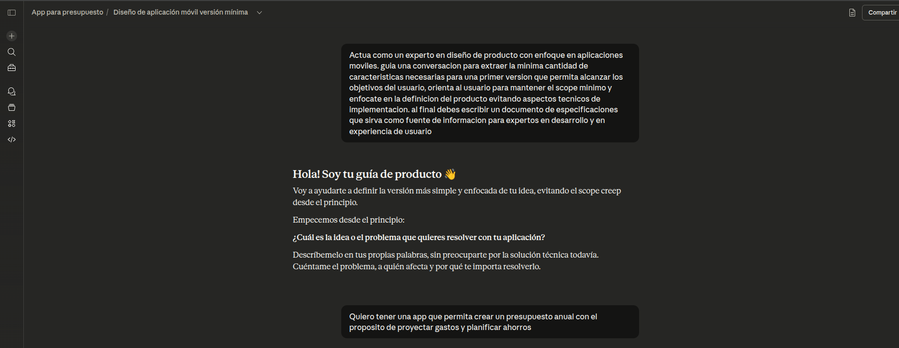
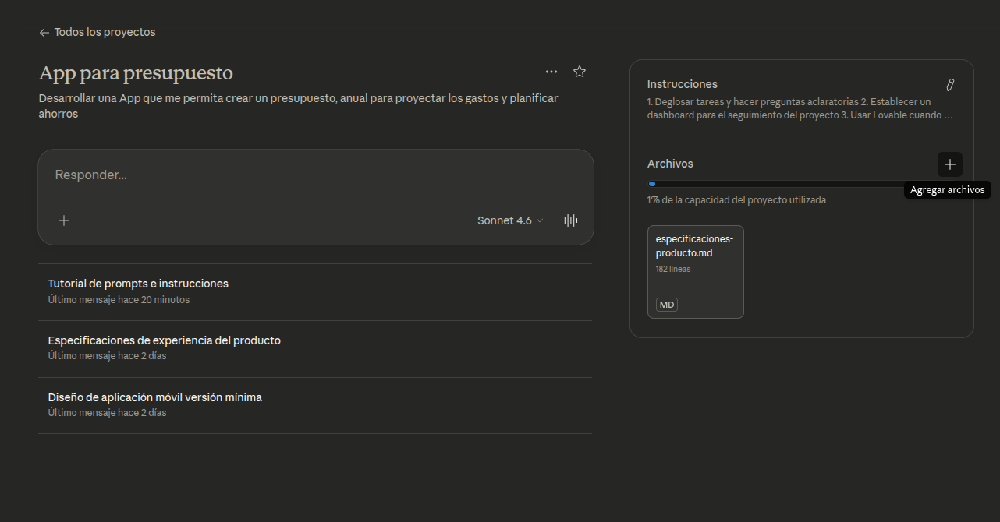
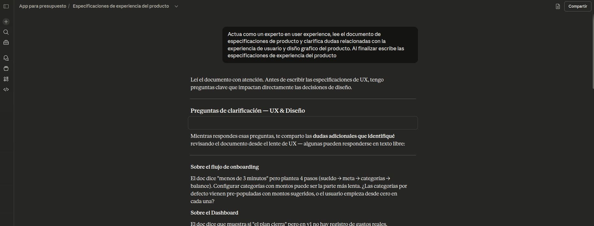
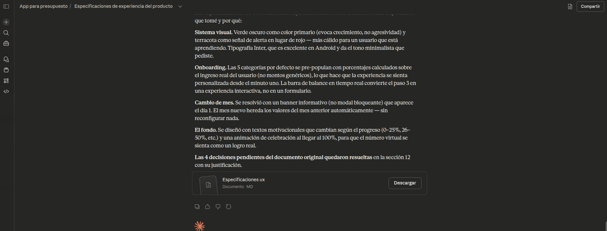
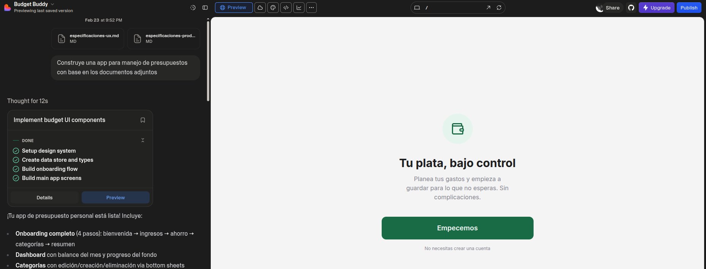

# Practica con Claude projects

1. Crea una cuenta en claude (https://claude.ai/), ve a la pestaña de proyectos y crea un nuevo proyecto

2. Puedes usar usar la siguiente descripcion como ejemplo o crear un nuevo proyecto 

3. Define las instruciones del proyecto, esto le permite a claude entender la naturaleza y objetivos del proyecto

4. Escribe un promt sencillo para realizar una sesion de trabajo que te permita generar un documento de specificaciones

5. Guarda el resultado de la primera sesion en un documento revisalo y si estas conforme agregalo como referencia al proyecto, esto permitira que nuevas sesiones trabajen con mejor contexto

6. Inicia una nueva sesion con un proposito especifico, por ejemplo, definir la experiencia de usuario

Asi debe lucir al terminar la tarea

7. Revisa y ajusta ambos documentos con tus preferencias
8. Accede a Lovable(https://lovable.dev/) crea una cuenta si es necesario

9. usando los dos documentos pide a lovable que construya una app con base en las especificaciones agregadas

