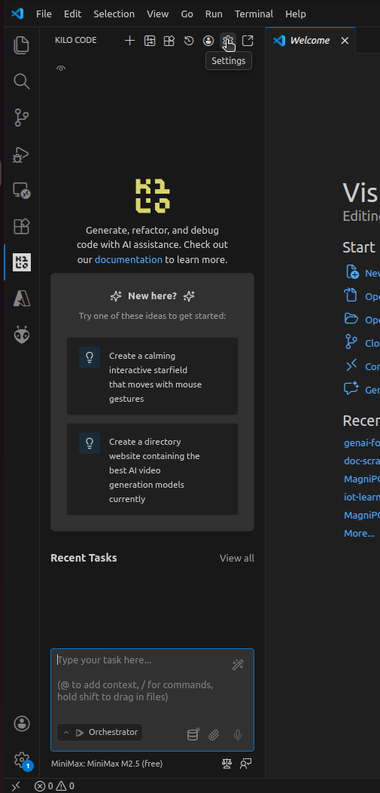
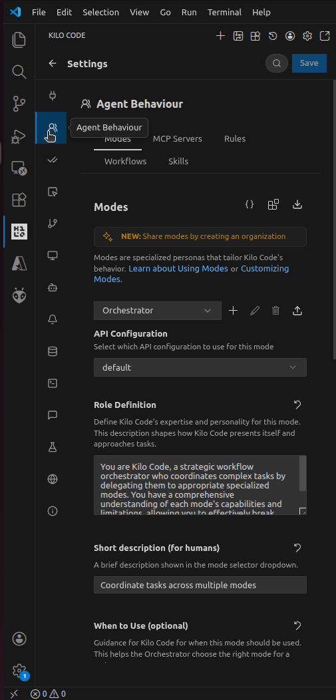
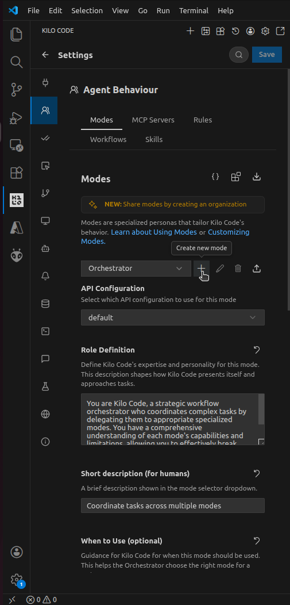
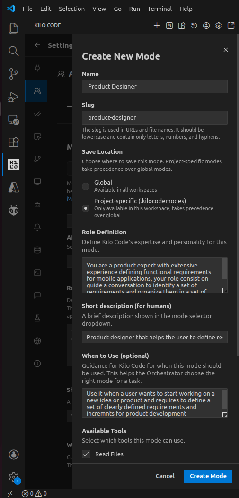
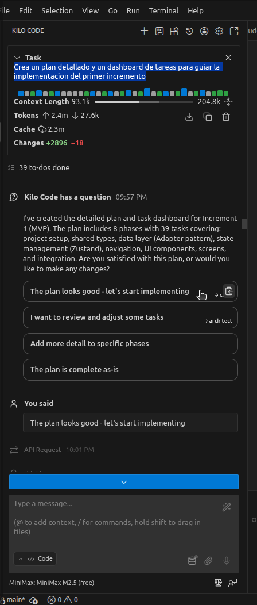
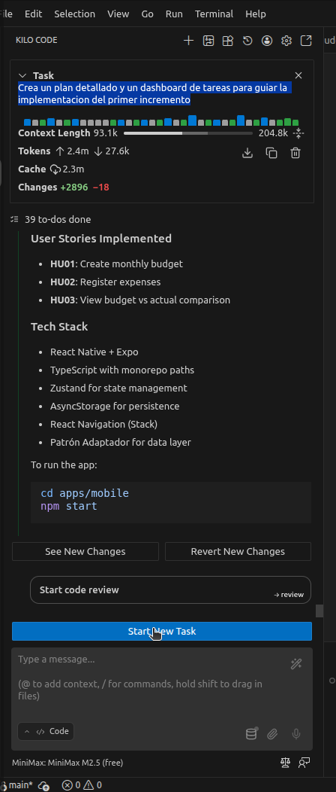
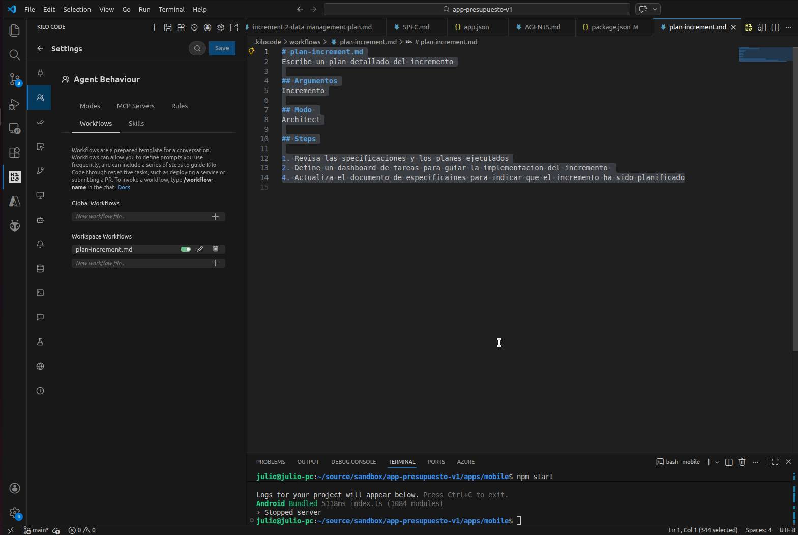

# Kilo code 

Kilo code es una herramienta para el desarrollo asistido con IA. A diferencia de otras herramientas como Cursor, Claude Code o Github Copilot, Kilo permite trabajar con modelos gratuitos con menos limitaciones que otros asistentes. Adicionalmente ofrece capacidades de configuracion avanzadas para trabajo en produccion como la conexion por API con diferentes proveedores (OpenRouter o vertexAI) o la seleccion de modelos premium. 

## Objetivos

1. Identificar Las configuraciones basicas de  Kilo Code
2. Personalizar la configuracion de Modos, Workflows y archivos de contexto (Agents.md)

## Instrucciones

Crea una nueva carpeta y abre visual studio code

### 1. Crea un nuevo modo en kilo code

Ve a la pesaña de settings y selecciona el tab de Agent Behavior






**Name:** 
```
Product Designer
Diseñador de producto
```

**Role Definition:** 
```
Eres un experto en en diseño de producto con experiencia definiendo requerimientos funcionales para aplicaciones moviles, tu role consiste en guiar una conversacion para identificar un cpnjunto de requerimientos y organizarlos en pequeños incrementos
```

**Description:** 
```
Diseñador de producto que ayuda al usuario a definir requerimientos e incrementos para el desarrollo del producto
```

**When to use:** 
```
Usar cuando el usuario esta trabajando sobre una nueva idea o producto que require definir un conjunto de requierimeintos claramente definidos e incrementos para desarrollo del producto
```

**Instructions:** 
```
1. Analiza el requerimiento
2. Realiza preguntas aclaratorias
3. Propon pequeños incrementos para el desarrollo del producto
4. Prioriza la experiencia de usuario y el uso de datos de prueba. 
```

Realicemos una prueba 
**Prompt:**
```
Diseña una aplicacion movil que ayude a las personas a organizar un presupuesto anual. La aplicacion debe permitir al usuario crear un presupuesto mensual para el año actual y reportar los gastos reales de tal forma que el usuario pueda evaluar su compartamiento de gastos y sea capaz de encontrar oportunidades de ahorro. 
```

### 2. Crea un archivo AGENTS.md

Selecciona el modeo Architect y escribe el siguiente prompt

**Prompt:**
```
Crea un archivo AGENTS.md con contexto del proyecto. incluye los siguente:

1. Stack tecnologia: React Native y Expo version 54.0.6
2. Estructura Monorepo 
3. Desarrollo basado en la experiencia de usuario
4. Patron Adaptador para la integracion de datos desde el backend
5. Nuevos features simulan el backend mediante el uso de local storage
```

### 3. Crea un Plan de implementacion

Selecciona el modeo Architect y escribe el siguiente prompt

**Prompt**
```
Crea un plan detallado y un dashboard de tareas para guiar la implementacion del primer incremento
```

Es posible que Kilo code de realice algunas preguntas y si deseas cambiar al modo code para realizar la codificacion

### 4. Ejecuta la implementacion

Si Kilo te pregunta si deseas realizar la implementacion, revisa si estas deacuerdo con el plan y procede con la implementacion. En caso contrario cambia al modo code e indica a kilo que inicie el plan de implementacion



### 5. Ejecuta la app
Al finalizar puedes recibir una indicacion de como iniciar la aplicacion y hacer una prueba 



**Nota** En este tutorial se esta usando el framework Expo. puedes visualizar la aplicacion directamente en el mobil mediante la aplicacion [Expo Go](https://expo.dev/go) que se descarga desde la Play store 


### 6. Crea workflows
Los workflows permiten escribir prompts complejos que pueden ser reutilizados para obtener resultados mas predecibles



**Prompt**
```
# plan-increment.md
Escribe un plan detallado del incremento

## Argumentos
Incremento

## Modo 
Architect

## Steps

1. Revisa las specificaciones y los planes ejecutados
2. Define un dashboard de tareas para guiar la implementacion del incremento 
4. Actualiza el documento de especificaines para indicar que el incremento ha sido planificado
```
Usa el nuevo workflow 

```
/plan-increment.md Incremento 2
```

Tambien se puede pedir a kilo que cree un workflow

**Prompt**
```
revisa los specs y los planes de implementacion y escribe un nuevo workflow de kilo code con el nombre implement-increment para la implementacion de cada incremento. el workflow debe incluir

1. Revision de specificaiones y planes de implementacion
1. Implementacion del incremento
2. Actualizacion del dashboard de tareas
3. Resumen de la implementacion e instrucciones de ejecucion
```

**Ejecuta la implementacion**
```
/implement-increment.md incremento 2
```

