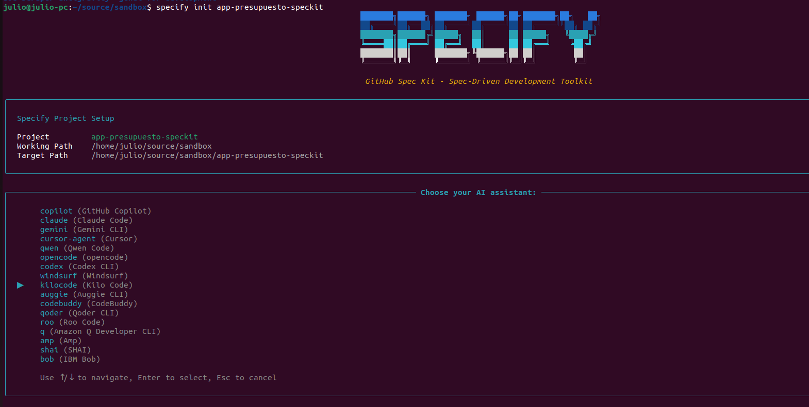

#  Spec Driven Development

El spec driven development es una metodologia que busca generar un contexto solido que sirva de base de conocimiento para que los agentes de IA generen mejores resultados.

## Objetivos

1. Aprender a usar speckit para hacer spec driven development

## 1. Instalacion de speckit e inicializacion del proyecto

[Speckit](https://github.com/github/spec-kit) es una implementacion especifica de Sepc driven development. con la instalacion se crea un nuevo comando de consola que permite inicializar un proyecto con prompts para implementar spec driven development

```
uv tool install specify-cli --from git+https://github.com/github/spec-kit.git
```

Inicializa un nuevo proyecto, seleccion kilo code 

```
specify init app-presupuesto-speckit
cd app-presupuesto-speckit
```



## 2. Establecer los principios del proyecto

```
/speckit.constitution.md 
1. Stack tecnologia: React Native y Expo version 54.0.6
2. Estructura Monorepo 
3. Desarrollo basado en la experiencia de usuario
4. Patron Adaptador para la integracion de datos desde el backend
5. Nuevos features simulan el backend mediante el uso de local storage

```

## 3. Crea la especificacion

```
/speckit.specify.md Diseña una aplicacion movil que ayude a las personas a organizar un presupuesto anual. La aplicacion debe permitir al usuario crear un presupuesto mensual para el año actual y reportar los gastos reales de tal forma que el usuario pueda evaluar su compartamiento de gastos y sea capaz de encontrar oportunidades de ahorro.
```

## 4. Crea un plan tecnico
```
/speckit.plan.md usa react native y Expo version 54.0.6, usa la minima cantidad de librerias externas e implementa el patron adaptador para que a futuro se pueda intercambiar local storage por un backend externo
```
## 5. Crea tareas
```
/speckit.tasks.md
```

## 6. Ejecuta la implementacion
```
/speckit.implement.md
```