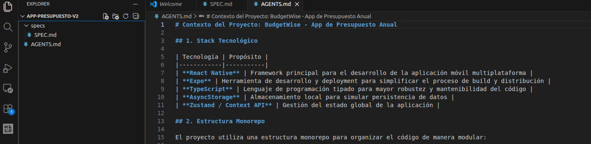
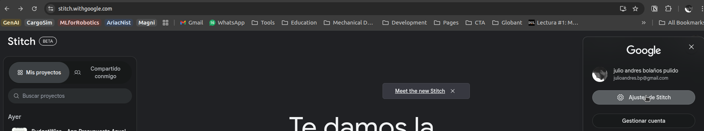
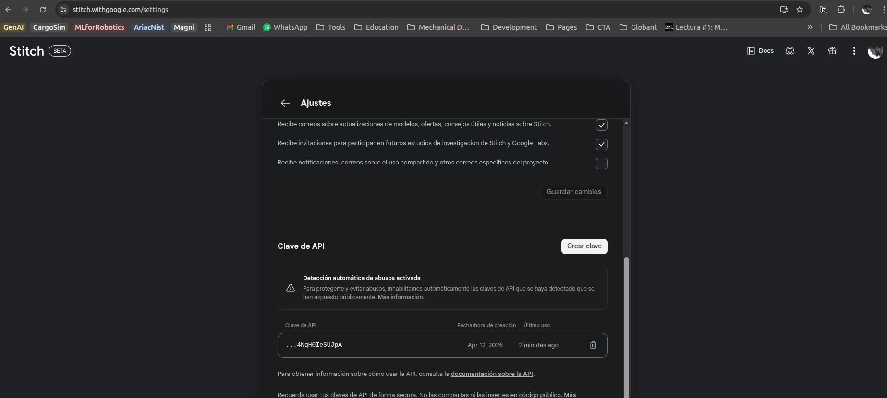
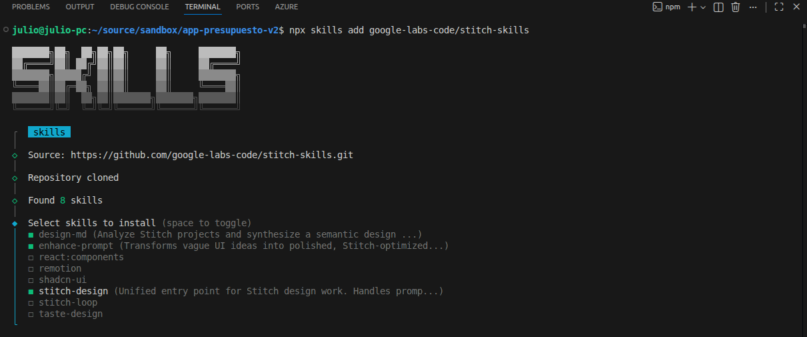
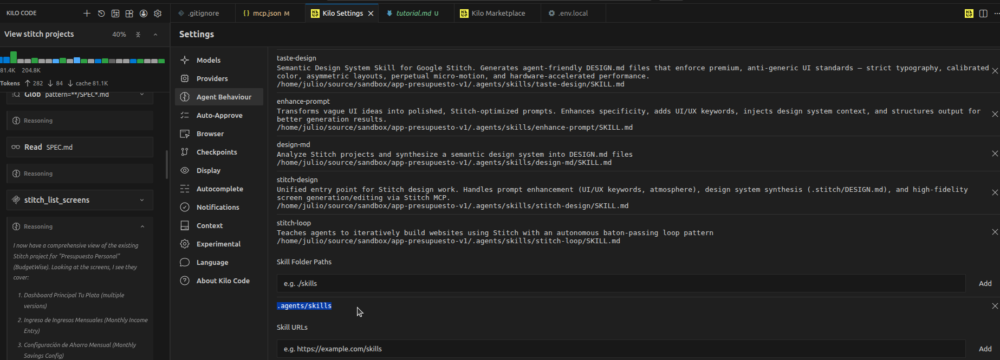
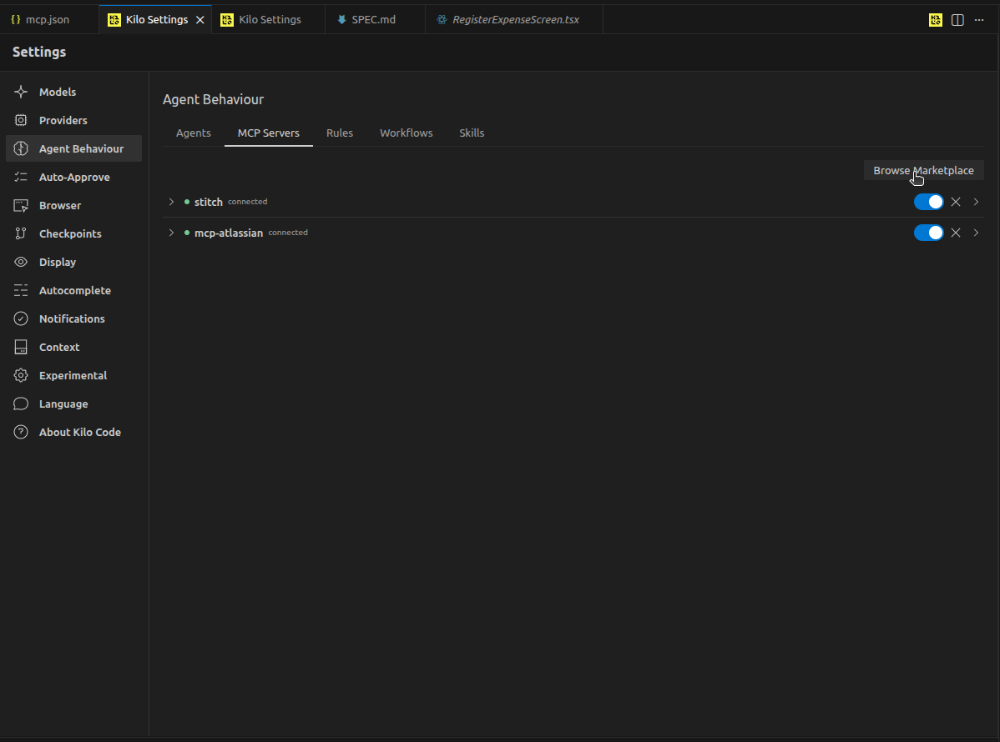
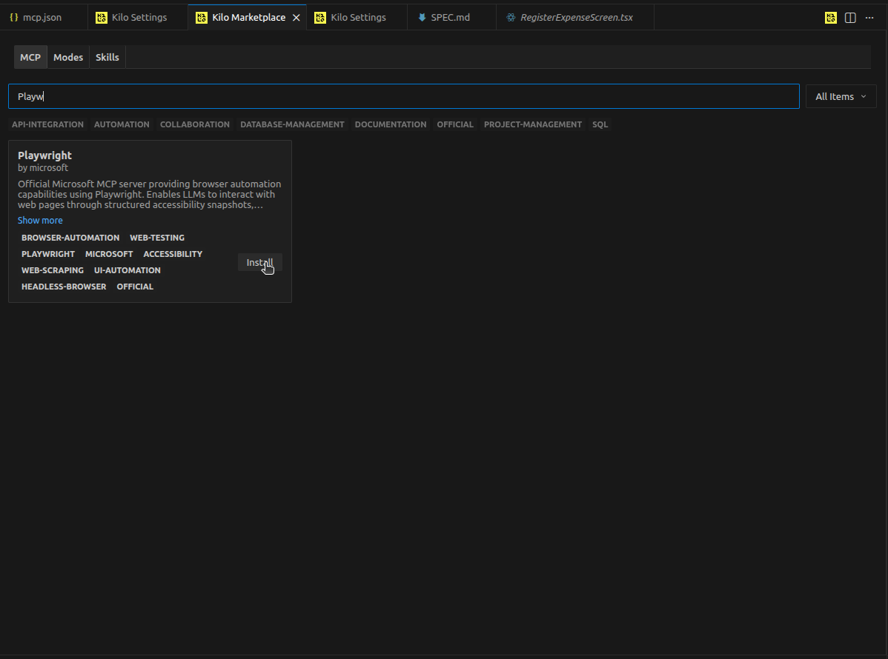

# Model Context Protocol
El protocolo MCP es un estandar de comunicacion que permite a los modelos de lenguaje usar herramientas externas, lo que aumenta la capacidades y usabilidad de los modelos.

# Objetivo
Conectar LLMs con herramientas (Stitch, Atlassian, Playwright) mediante el protocolo MCP

# Antes de empezar. 

Crear una carpeta raiz para el projecto y copia usa el contenido de los archivos `SPEC_example.md` y `AGENTS_example.md` como base para el proyecto



# 1.Flujo de trabajo con Stitch MCP
Stitch es una herramienta de generación de interfaces de usuario mediante IA que permite crear diseños de alta fidelidad para móviles y desktops.

## 1.1 Configuracion de MCP en kilo code

En tu proyecto localiza o crea el archivo `.kilocode/mcp.json` y agrega lo siguiente 

```json
{
    "mcpServers": {
        "stitch": {
            "url": "https://stitch.googleapis.com/mcp",
            "type": "streamable-http",
            "headers": {
                "Accept": "application/json",
                "X-Goog-Api-Key": "YOUR_API_KEY"
            },
            "disabled": false
        }
    }
}
```

crea y agrega el API_KEY de stitch https://stitch.withgoogle.com/





## 1.2 Instalar SKILLS de Stitch
En el repositorio de google labs hay uno con SKILLS que nos pueden ayudar a mejorar los resultados de trabajar con Stitch. ve a https://github.com/google-labs-code/stitch-skills.

para instalar los skills ejecuta el siguiente comando y sigue las instrucciones

```bash
npx skills add google-labs-code/stitch-skills
```



Despues de instalar los skills asegurate que puedan ser usados por Kilo code




## 1.3 Diseña con stitch
Escribe el siguiente prompt usando el modo Plan

```
Crea un plan para el diseño de una aplicacion movil con stitch con base en el documento de especificaciones @specs/SPEC.md
```

El sistema puede hacer preguntas aclaratorias o preguntar si deseas continuar con la implementacion del. selecciona la opcion mas favorable. revisa el plan antes de iniciar la implementacion

una vez completado el diseño en stitch utiliza el siguinete prompt 

```
Analiza el diseño creado en stitch y crea un documento DESIGN.md detallado en la raiz del proyecto para documentar el sistema de diseño. Usa desig-md skill
```


# 2. Flujo de trabajo con Atlassian MCP

## 2.1 Instalar el MCP de Atlassian

En tu proyecto localiza el archivo `.kilocode/mcp.json` y agrega lo siguiente 

```json
"mcp-atlassian": {
            "command": "uvx",
            "args": [
                "mcp-atlassian"
            ],
            "env": {
                "JIRA_URL": "https://julioandresbp.atlassian.net",
                "JIRA_USERNAME": "YOUR_USER",
                "JIRA_API_TOKEN": "YOUR_API_TOKEN"
            },
            "disabled": false,
            "alwaysAllow": [
                "jira_batch_create_issues",
                "jira_create_issue"
            ]
        }
```

## 2.2 Crear plan e implementacion de incrementos 
con atlassian instalado, usa el siguiente prompt para crear un plan de implementacion que se vea reflejado en jira 

```
Crea un plan para la implementacion del primer incremento. incluye en el plan el uso de los diseños y las pantallas creadas con stitch, asegurate de que en la implementacion se descargen los HTML desde stitch y se usen para obtener exactamente las pantallas esperadas. Al finalizar crea en plan como una nueva historia de usuario en Jira
```

el sistema te puede hacer preguntas aclaratorias como el tipo de issue, el proyecto etc. 

Una vez creado el plan el sistema te puede pregutar si deseas proceder con la implementacion. 

Al finalizar la implementacion es posible que la applicacion no funcione o los assets no esten bien creados es necesario iterar hasta conseguir el resultado o definir prompts con instrucciones mas precisas

una vez se obtenga la primera version de la aplicacion puedes planear el segundo incremento

```
Crea un plan para la implementacion del segundo incremento definido en las specificaciones. Al finalizar crea en plan como una nueva historia de usuario en Jira
```

Es posible que tengas que pedirle explicitamente al sistema que implemente una historia de usuario. para esto usa un prompt como 

```
Analiza e implementa la historia de usiario de jira {ID historia de usario en jira}
```

# 3. Flujo de trabajo con playwright 
## 3.1 Instalacion de playwright
Usando el marketplace de kilo code 





## 3.2 Creacion de casos de prueba 
```
Con base en el archivo @specs/SPEC.md y en los planes de implementacion, escribe un conjunto de casos de prueba en lenguaje natural para validar los comportamientos implementados. cada caso de prueba debe estar estructurado de la siguiente manera:

## Objetivo del test
Descripcion del objetivo de caso

## Prerequisitos
lista de punto con los prerequisitos para el test. datos de prueba, estados anteriores, etc

## Steps
lista de pasos con los resultados esperados en cada paso

create una historia de usuario en jira por cada caso de prueba
```

## Ejecucion de casos de prueba 

```
la plicacion esta corriendo en http://localhost:8081. utiliza el mcp de playwright para ejecutar las pruebas y consolida los resultados en un archivo test_results.md en la carpeta /tests_results en la raiz del proyecto
```
