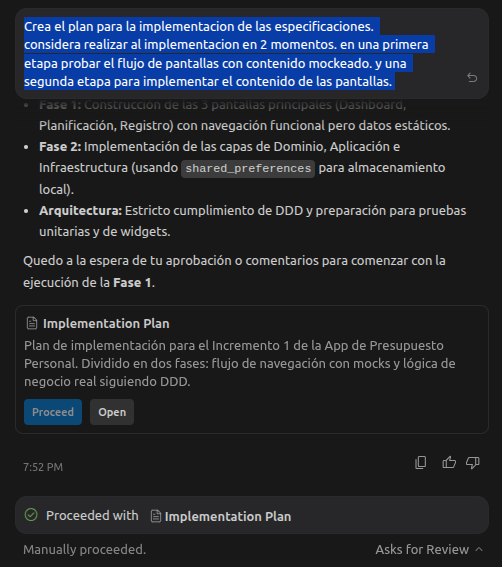

# Antigravity

## Instala antigravity

## Instala Flutter

## Define un workflow en antigravity

## Define un archivo de especificaciones
Promt:
```
design-assistant
ayudame a definir el primer incremento para una aplicacion de gestion de presupuesto personal que permita planeal el presupuesto mensual, de tal forma que pueda evaluar mi comportamiento de gastos
```

## Crea un Archivo AGENTS.md

```
Con base en las specificaciones y en la estructura de proyecto. crea un Archivo AGENTS.md con informacion importante del proposito y estructura del proyecto. incluye: 

1. La aplicaicon debe estar estructurada usando Domain Driven Design (DDD), es necesario que las capas de presentacion, Aplicacion, Dominio e infrastructura esten claramente separadas :

Capa de prensentacion: Encargada de contener los componenetes, pantallas y los flujos de usuario

Capa de aplicacion: Encargada de orquestar las entidades del dominio

Capa de Dominio: encargada de mantener las entidades centrale de la aplicacion

Capa de Infrastructura: Encargada de implementar repositios y acceso a datos o servicios externos 

2. Todo incremento debe incluir pruebas
```

## Crea un plan de implementacion 

```
Crea el plan para la implementacion de las especificaciones. 
considera realizar al implementacion en 2 momentos. en una primera etapa probar el flujo de pantallas con contenido mockeado. y una segunda etapa para implementar el contenido de las pantallas. 
```



## Realiza un diseño premium con stitch
## Instala MCP y skills de stitch

```
revisa si tienes acceso a los skills de stitch y la herramientas de diseño del mcp de stitch
```

```
utiliza el skill 
stitch-design
para diseñar las pantallas de la aplicacion con stitch
```

```
planifica los cambions necesarios para implementar el sistema de diseño y los diseños generados con stitch
```
## Valida que no hay problemas 

```
utilice el comando flutter analize y realice las correcciones necesarias hasta que no haya errores
```